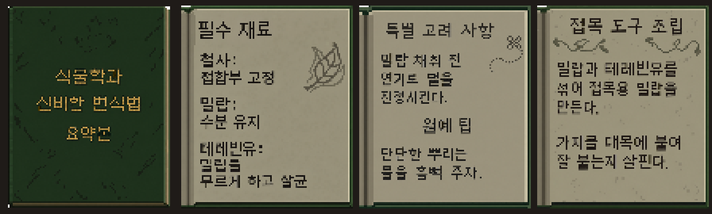

# Camp Whittlewood 한국어 패치 / 한글패치

**v0.3.1 검수판**입니다. 대사와 메뉴에는 Mona12 Text KR 14px를 사용하고, 식물학 책 네 페이지의 그림 속 영어도 한글화했습니다. 메인 메뉴 오른쪽 아래에는 `번역 : 여우불`을 표시합니다. 이번 버전에서는 이 표기의 축소를 없애고 밝기와 가장자리 여백을 조정했습니다.

1. [복사·붙여넣기 ZIP 다운로드](https://github.com/BaeSean/camp-whittlewood-Korean/raw/refs/heads/main/CampWhittlewood-Korean-CopyPaste.zip) 후 게임 밖에 압축을 풉니다.
2. 게임을 종료하고 **`CampWhittlewood.exe`와 `data.win`이 있는 폴더**를 엽니다. Steam에서는 게임 우클릭 → 관리 → 로컬 파일 보기를 누릅니다.
3. **기존 `data.win`을 게임 밖에 백업**한 뒤, ZIP의 `data.win`을 게임 폴더에 붙여넣고 덮어씁니다.
4. 게임을 실행합니다. **설치기·패처·Python 실행은 필요 없습니다.**

복원하려면 게임을 종료하고 백업한 원본 `data.win`을 같은 위치에 덮어쓰십시오. 원본 게임이 필요하며 다른 게임 버전·다른 패치와 혼용하지 마십시오. 세이브는 포함하거나 설치 중 변경하지 않지만 중요한 진행 상황은 별도 백업을 권합니다.

v0.2.4까지의 수정에 더해 식물학 책의 상세 한글 대사, Mona12 Text KR 14px, 식물학 책 네 쪽 이미지, 메인 메뉴의 번역 크레딧을 추가했습니다. 책 그림의 짧은 문장은 작은 페이지에 맞춘 요약이고, 자세한 설명은 기존 대사창에 남아 있습니다. 다른 조작 안내·간판·장식 이미지는 원문을 유지합니다.

이번 변경의 확인 범위: 한글 글리프, 게임 데이터 파싱, 메인 메뉴 코드 디컴파일, 책 이미지 네 장의 패치 후 추출·픽셀 대조, ZIP 내용과 해시. **v0.3.1 메뉴 크레딧의 실제 게임 화면 재검수는 아직 완료하지 않았습니다.**

ZIP에는 수정 `data.win`, 설치 안내와 Neo둥근모·Mona 관련 글꼴 라이선스 고지만 들어 있습니다. 게임 실행 파일·원본 백업·세이브·설치 프로그램은 포함하지 않습니다. 비공식 번역 패치이며 게임·기존 자산의 권리는 각 권리자에게 있습니다.

지원 원본 `data.win` SHA-256: `59660c2c2b881e075436eff0d17ad41a31fc594f7f61950845d4fefad8d07ead`

패치 `data.win` SHA-256: `994a445db7104c2dad2cf0d1790f8f8f820036eeb9d0bb776493896f1af66571`

ZIP SHA-256: `624fa1b85714df03f9c8c5f182326344e9742503e0f0b7894414e3801acb73b5`
